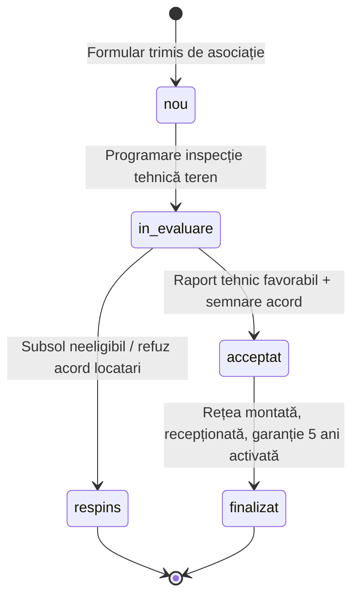

# Schema Bazei de Date & FSM (Zero Orbie Booleană)

## 1. Tabele Supabase / PostgreSQL Active

### A. Cereri de Audit / Asociații (`associations`)
* `id`: TEXT PRIMARY KEY
* `dosar_number`: TEXT NULL — Număr unic de dosar în registrul civic (ex: "DOSAR-PH-101")
* `name`: TEXT NOT NULL — Nume solicitant / reprezentant
* `phone`: TEXT NOT NULL — Telefon contact
* `building`: TEXT NOT NULL — Nume Asociație / Bloc (ex: "Asociația Bloc 14A")
* `address`: TEXT NOT NULL — Adresă completă din Ploiești
* `problem`: TEXT NOT NULL — Descrierea tehnică a defecțiunii / inundației
* `status`: TEXT NOT NULL DEFAULT 'nou' — ('nou', 'in_evaluare', 'acceptat', 'respins', 'finalizat')
* `forms_collected`: INTEGER NOT NULL DEFAULT 0 — Număr formulare ANAF 230 strânse
* `forms_target`: INTEGER NOT NULL DEFAULT 40 — Ținta de formulare necesară
* `funds_collected`: INTEGER NOT NULL DEFAULT 0 — Bani manoperă strânși (RON)
* `funds_target`: INTEGER NOT NULL DEFAULT 12000 — Ținta de fonduri manoperă (RON)
* `created_at`: TIMESTAMPTZ NOT NULL DEFAULT NOW()
* `is_archived`: BOOLEAN NOT NULL DEFAULT false

### B. Parteneri Acreditați & Tehnici (`partners`)
* `id`: TEXT PRIMARY KEY
* `name`: TEXT NOT NULL — Denumire companie / partener
* `role`: TEXT NOT NULL — Rol oficial (ex: Partener Tehnic de Execuție & Mentenanță)
* `category`: TEXT NOT NULL DEFAULT 'executie' — ('executie', 'practica', 'comunitate', 'academic')
* `description`: TEXT NOT NULL
* `logo_url`: TEXT
* `website`: TEXT
* `badge_text`: TEXT

### C. Solicitări Noi de Parteneriat (`partner_applications`)
* `id`: TEXT PRIMARY KEY
* `company_name`: TEXT NOT NULL
* `phone`: TEXT NOT NULL
* `description`: TEXT NOT NULL
* `status`: TEXT NOT NULL DEFAULT 'nou' — ('nou', 'contactat', 'arhivat')
* `created_at`: TIMESTAMPTZ NOT NULL DEFAULT NOW()

### D. Donații & Sponsorizări (`donations`)
* `id`: TEXT PRIMARY KEY
* `type`: TEXT NOT NULL — ('bani' | 'materiale')
* `target_association_name`: TEXT NULL — Asociație destinatară sau Fond General Ploiești
* `amount_ron`: INTEGER NULL — Sumă în RON
* `material_type`: TEXT NULL — Tip materiale (țevi PPR, fitinguri, izolație)
* `material_quantity`: INTEGER NULL
* `material_unit`: TEXT NULL (buc, m, kit)
* `donor_name_or_company`: TEXT NOT NULL
* `donor_phone`: TEXT NOT NULL
* `donor_email`: TEXT NULL
* `status`: TEXT NOT NULL DEFAULT 'inregistrat' — ('inregistrat', 'confirmat', 'finalizat')
* `created_at`: TIMESTAMPTZ NOT NULL DEFAULT NOW()

### E. Formulare 230 ANAF (`formulare_230`)
* `id`: TEXT PRIMARY KEY
* `created_at`: TIMESTAMPTZ NOT NULL DEFAULT NOW()
* `last_name`: TEXT NOT NULL, `first_name`: TEXT NOT NULL, `initiala_tata`: TEXT
* `cnp`: TEXT NOT NULL
* `email`: TEXT NOT NULL, `phone`: TEXT NOT NULL
* `address`: TEXT NOT NULL, `city`: TEXT NOT NULL DEFAULT 'Ploiești', `county`: TEXT NOT NULL DEFAULT 'Prahova'
* `signature_data_url`: TEXT NOT NULL (Base64 PNG)
* `distribute_for_2_years`: BOOLEAN NOT NULL DEFAULT true
* `consent_borderou`: BOOLEAN NOT NULL DEFAULT true
* `status`: TEXT NOT NULL DEFAULT 'inregistrat' — ('inregistrat', 'validat', 'depus_anaf')

### F. Metrici Globale (`metrics`) & Configurare ONG (`ong_config`)
* `metrics`: id=1, total_forms_collected, total_forms_target, total_funds_collected_ron, total_funds_target_ron, active_associations_count
* `ong_config`: id=1, name, cif, iban, bank, percentage ('3,5%'), distribute_years (2)

### G. Proiecte & Galerie Foto pe Etape (`projects`)
* `id`: TEXT PRIMARY KEY — Identificator unic proiect (ex: "proj-1")
* `title`: TEXT NOT NULL — Titlu proiect / bloc reabilitat
* `description`: TEXT NOT NULL — Descriere tehnică detaliată
* `status`: TEXT NOT NULL DEFAULT 'finalizat' — ('in_curs' | 'finalizat')
* `before_image`: TEXT NOT NULL — Imagine reprezentativă principală "Înainte"
* `after_image`: TEXT NOT NULL — Imagine reprezentativă principală "După"
* `completion_date`: TEXT NOT NULL — Data recepției oficiale
* `neighborhood`: TEXT NULL — Cartier Ploiești (ex: "Nord", "Centru")
* `gallery`: JSONB DEFAULT '[]'::jsonb — Set complet de fotografii pe etape:
  * `id`: TEXT NOT NULL
  * `url`: TEXT NOT NULL (stocare Supabase Storage bucket `viziune-assets`)
  * `caption`: TEXT NULL — Legendă tehnică
  * `stage`: TEXT NOT NULL — ('inainte' | 'in_lucru' | 'dupa')
  * `created_at`: TIMESTAMPTZ NULL
* `is_archived`: BOOLEAN NOT NULL DEFAULT false

---

## 2. Automat Finit de Stare (FSM) — Audit Request Lifecycle

## 3. Motorul de Export Centralizat (`/admin`)

Toate exporturile din panoul de administrare utilizează standardul **RFC 4180** îmbogățit cu **UTF-8 Byte Order Mark (`\uFEFF`)** pentru compatibilitate nativă cu Microsoft Excel pe sisteme de operare Windows cu setări regionale din România (fără alterarea diacriticelor `ă, î, ș, ț, â`).

* **Export Borderou ANAF 230:** generare registru centralizator pentru depunere fiscală.
* **Export Registru Asociații:** fișă tehnică completă cu procente colectare și devize manoperă.
* **Export Candidaturi Parteneri:** solicitări primite de la instalatori și companii tehnice.
* **Export Registru Donații:** registru contabil cu donații financiare și sponsorizări în materiale.

## 4. Politica de Afișare Publică a Proiectelor & Scalabilitate Selector

1. **Izolare Publică:** Rutele publice (`/api/public/data`, pagina principală `/` și `/arhiva-lucrari`) filtrează strict `status === 'finalizat' && is_archived === false`. Șantierele marcate ca `in_curs` sunt tratate ca lucrări interne și rămân vizibile exclusiv în panoul securizat `/admin`.
2. **Management în Panoul de Administrare:**
   - Filtre rapide pe tab-ul de proiecte: `Toate`, `Doar Finalizate`, `În Curs`.
   - Selector `<select>` imbogățit cu etichete de status (`[FINALIZAT]` / `[ÎN CURS]`).
   - Comutare instantă de status (Toggle `finalizat` <-> `in_curs`) cu persistare automată în Supabase.
3. **Scalabilitate Selector:** Atât în `/` (`ProjectsGallery.tsx`), cât și în `/arhiva-lucrari` și `/admin`, interfețele oferă un selector `<select>` dropdown nativ + bară orizontală de scroll, garantând o experiență fluidă indiferent de numărul de proiecte înregistrate în baza de date.

## 5. Politica Duală de Gestiune a Datelor: Arhivare (Soft Delete) vs. Ștergere Definitivă (Hard Delete)

Pentru a asigura control operațional absolut și prevenirea pierderilor accidentale de date, toate entitățile din sistem dispun de acțiuni distincte în interfața administrativă:

1. **Arhivare (Soft Delete — Buton „Arhivează”):**
   * Setează flag-ul `is_archived = true` sau `status = 'arhivat'`.
   * Înregistrarea devine invizibilă pe site-ul public și în listele active administrative, dar este conservată integral în PostgreSQL pentru audit fiscal, istoric și recuperare.
2. **Ștergere Definitivă (Hard Delete — Buton dedicat roșu „Șterge Definitiv din DB”):**
   * Declanșează apeluri server-side securizate către rutele administrative protejate prin sesiune admin.
   * Execută instrucțiunea SQL `DELETE FROM <table> WHERE id = :id`.
   * **Curățare Fizică Supabase Storage:** La ștergerea definitivă a unui proiect sau a unei fotografii individuale din galerie, fișierele binare sunt eliminate fizic din bucket-ul Supabase Storage (`proiecte` / `Proiecte`) via API-ul de storage (`supabaseAdmin.storage.from(bucket).remove([filePath])`), eliminând fișierele orfane și consumul nejustificat de spațiu.
   * **Barieră de Siguranță:** Orice acțiune de Hard Delete solicită confirmare explicită din partea administratorului, atenționând asupra caracterului ireversibil al operațiunii.

