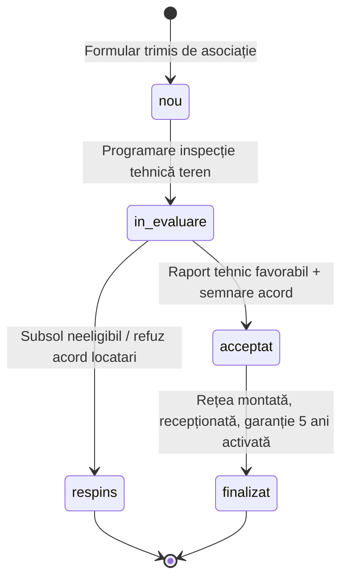

# Schema Bazei de Date & FSM (Zero Orbie Booleană)

## 1. Tabele Principale

### A. Cereri de Audit / Asociații (`audit_requests`)
* `id`: serial / integer primary key
* `name`: varchar(255) — Nume solicitant
* `phone`: varchar(50) — Telefon (Branded Masked pe frontend public)
* `building`: varchar(255) — Nume Asociație / Bloc (ex: "Asociația Bloc 14A")
* `address`: text — Adresă completă din Ploiești
* `problem`: text — Descrierea tehnică a defecțiunii / inundației
* `status`: enum('nou', 'in_evaluare', 'acceptat', 'respins', 'finalizat')
* `forms_collected`: integer default 0 — Număr formulare ANAF 230 strânse
* `forms_target`: integer default 0 — Ținta de formulare necesară pentru sponsorizare
* `funds_collected`: integer default 0 — Bani manoperă strânși (lei)
* `funds_target`: integer default 0 — Ținta de fonduri manoperă (lei)
* `created_at`: timestamp with time zone default now()

### B. Proiecte de Reabilitare (`projects`)
* `id`: serial / integer primary key
* `title`: varchar(255)
* `description`: text
* `status`: enum('in_curs', 'finalizat')
* `before_image_path`: text
* `after_image_path`: text
* `created_at`: timestamp with time zone default now()

### C. Donații & Sponsorizări (`donations`)
* `id`: serial / integer primary key
* `type`: enum('bani', 'materiale')
* `target_association_name`: varchar(255) nullable — Asociația specifică aleasă sau "Fond General"
* `amount_ron`: integer nullable — Sumă donată (lei)
* `material_type`: varchar(100) nullable — Tip materiale (țevi, robineți, izolație)
* `material_quantity`: integer nullable — Cantitate
* `material_unit`: varchar(20) nullable — Unitate de măsură (m, buc, etc.)
* `donor_name_or_company`: varchar(255) — Nume donator sau companie
* `donor_phone`: varchar(50) — Telefon contact
* `donor_email`: varchar(255) nullable — Email contact
* `status`: enum('inregistrat', 'confirmat', 'finalizat')
* `created_at`: timestamp with time zone default now()

---

## 2. Automat Finit de Stare (FSM) — Audit Request Lifecycle

Tranzițiile de stare sunt exclusiv deterministe:

